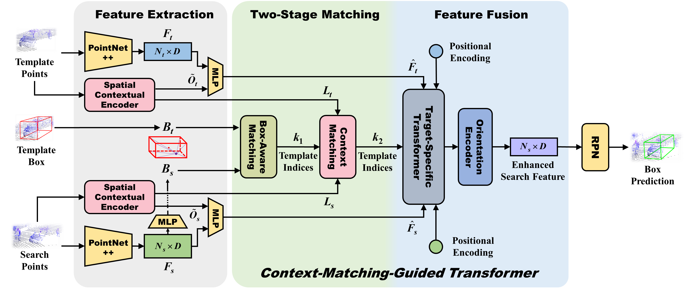

# CMT for 3D Tracking in Point Clouds

Official implementation of the [**ECCV 2022** paper](https://link.springer.com/chapter/10.1007/978-3-031-20047-2_6) *CMT: Context-Matching-Guided Transformer for 3D Tracking in Point Clouds*



> How to effectively match the target template features with the search area is the core problem in point-cloud-based 3D single object tracking. However, in the literature, most of the methods focus on devising sophisticated matching modules at point-level, while overlooking the rich spatial context information of points. To this end, we propose **C**ontext-**M**atching-Guided **T**ransformer (**CMT**), a Siamese tracking paradigm for 3D single object tracking. In this work, we first leverage the local distribution of points to construct a horizontally rotation-invariant contextual descriptor for both the template and the search area. Then, a novel matching strategy based on shifted windows is designed for such descriptors to effectively measure the template-search contextual similarity. Furthermore, we introduce a target-specific transformer and a spatial-aware orientation encoder to exploit the target-aware information in the most contextually relevant template points, thereby enhancing the search feature for a better target proposal. We conduct extensive experiments to verify the merits of our proposed CMT and report a series of new state-of-the-art records on three widely-adopted datasets.

## Setup

### Installation

- Create the environment
  ```shell
  git clone https://github.com/jasongzy/CMT.git
  cd CMT
  conda create -n cmt python=3.8
  conda activate cmt
  ```

- Install pytorch
  ```shell
  conda install pytorch torchvision cudatoolkit=11.3 -c pytorch
  ```

- Install other dependencies:
  ```shell
  pip install -r requirement.txt
  ```

### Datasets

Please follow the setup guide of [Open3DSOT](https://github.com/Ghostish/Open3DSOT#setup).

## Citation

```bibtex
@inproceedings{guo2022cmt,
  title={CMT: Context-Matching-Guided Transformer for 3D Tracking in Point Clouds},
  author={Guo, Zhiyang and Mao, Yunyao and Zhou, Wengang and Wang, Min and Li, Houqiang},
  booktitle={ECCV},
  year={2022}
}
```

## Acknowledgment

- This repo is built upon [BAT](https://github.com/Ghostish/BAT).
- Thank Erik Wijmans for his pytorch implementation of [PointNet++](https://github.com/erikwijmans/Pointnet2_PyTorch).
- Thank the implementation of PointSIFT in [3DNetworksPytorch](https://github.com/lelouedec/3DNetworksPytorch).
